# AWS-End-To-End-Infrastructure-Project
End-to-End AWS Infrastructure Deployment using EC2, EBS, AMI, Launch Templates, ALB, Auto Scaling, SNS, CloudWatch, Lambda and CloudFormation.
# aws-end-to-end-infrastructure-project

Designed and deployed a highly available AWS infrastructure using EC2, EBS, Snapshots, AMIs, Launch Templates, Application Load Balancer, Auto Scaling Groups, SNS, CloudWatch, Lambda, and CloudFormation.

🚀 End-to-End AWS Infrastructure Deployment Using Auto Scaling and CloudFormation

AWS EC2 • EBS • ALB • ASG • SNS • CloudWatch • Lambda • CloudFormation

---

# 📌 Project Overview

This project demonstrates the deployment of a highly available web infrastructure on AWS using multiple AWS services commonly used in production environments.

The primary objective was to gain hands-on experience with:

* AWS Compute Services
* Storage Management
* Load Balancing
* Auto Scaling
* Monitoring & Alerting
* Infrastructure Automation
* High Availability Architecture
* Infrastructure as Code (IaC)

---

# 🏗️ Architecture

Internet

↓

Application Load Balancer (ALB)

↓

Target Group

↓

Auto Scaling Group (ASG)

↓

EC2 Instances

↓

Apache Web Server

↓

EBS Volumes

↓

Snapshots & AMIs

CloudWatch → SNS → Email Notifications

CloudFormation → Infrastructure Automation

---

# 🛠️ AWS Services Used

### Compute

* Amazon EC2
* Auto Scaling Group
* Launch Templates

### Storage

* Amazon EBS
* EBS Snapshots
* Amazon Machine Images (AMI)

### Networking

* Security Groups
* Target Groups
* Application Load Balancer (ALB)

### Monitoring & Notifications

* Amazon CloudWatch
* Amazon SNS

### Serverless

* AWS Lambda

### Infrastructure as Code

* AWS CloudFormation

---

# ⚙️ Project Implementation

## Phase 1 – Security Group

Created a Security Group named:

WebServer-SG

Allowed inbound traffic:

| Protocol | Port |
| -------- | ---- |
| SSH      | 22   |
| HTTP     | 80   |

---

## Phase 2 – EC2 Instance

Created an EC2 instance:

* Amazon Linux
* t3.micro
* SSH Key Pair Authentication
* Public IP Enabled

Installed Apache Web Server.

---

## Phase 3 – EBS Volume

Created and attached:

WebServer-Volume

* Size: 5 GiB
* Type: gp3

Attached to EC2 instance.

---

## Phase 4 – Apache Web Server Deployment

Installed Apache:

```bash
sudo yum install httpd -y
sudo systemctl start httpd
sudo systemctl enable httpd
```

Hosted a custom website under:

```bash
/var/www/html
```

---

## Phase 5 – Snapshot Creation

Created EBS Snapshot:

WebServer-Snapshot

Used for backup and disaster recovery.

---

## Phase 6 – AMI Creation

Created custom AMI:

WebServer-AMI

Captured:

* Operating System
* Apache Configuration
* Website Files
* Attached Volume Information

---

## Phase 7 – Launch Template Version 1

Created Launch Template:

WebServer-LT

Version 1 configured with:

* AMI
* Instance Type
* Security Group
* Key Pair

---

## Phase 8 – Target Group

Created:

WebServer-TG

Registered EC2 instance and verified healthy status.

---

## Phase 9 – Application Load Balancer

Created:

WebServer-ALB

Configured:

* Internet Facing
* HTTP Listener
* Target Group Association

---

## Phase 10 – Load Balancer Testing

Verified website accessibility using:

ALB DNS Name

Successfully routed traffic to backend instance.

---

## Phase 11 – Auto Scaling Group

Created:

WebServer-ASG

Configuration:

* Desired Capacity = 2
* Minimum Capacity = 2
* Maximum Capacity = 4

Integrated with Target Group.

---

## Phase 12 – SNS Notifications

Created SNS Topic:

WebServer-SNS

Subscribed email endpoint and confirmed notifications.

---

## Phase 13 – CloudWatch Monitoring

Created Alarm:

HighCPUAlarm

Threshold:

* CPU Utilization > 70%

Configured SNS notifications.

---

## Phase 14 – AWS Lambda

Created Lambda Function:

EC2MonitorLambda

Used for automation and monitoring demonstrations.

---

## Phase 15 – Launch Template Version 2

Created:

WebServer-LT Version 2

Updated AMI with enhanced website configuration.

---

## Phase 16 – Auto Scaling Group Update

Updated ASG to use:

Launch Template Version 2

Verified successful deployment.

---

## Phase 17 – CloudFormation

Created Stack:

WebServer-Stack

Demonstrated Infrastructure as Code (IaC) deployment using CloudFormation.

---

# 📸 Project Screenshots

## Security Group

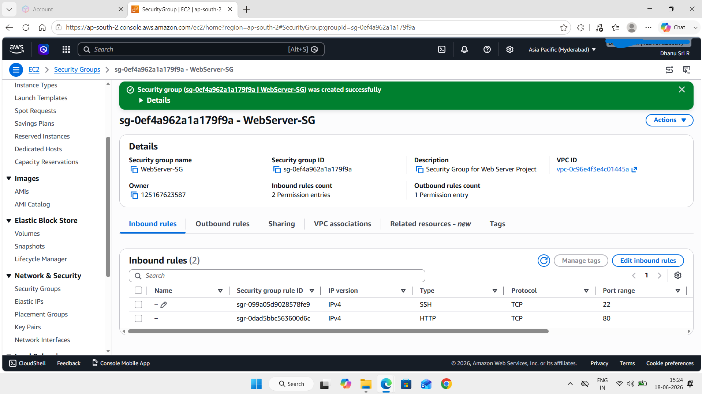

## EC2 Instance

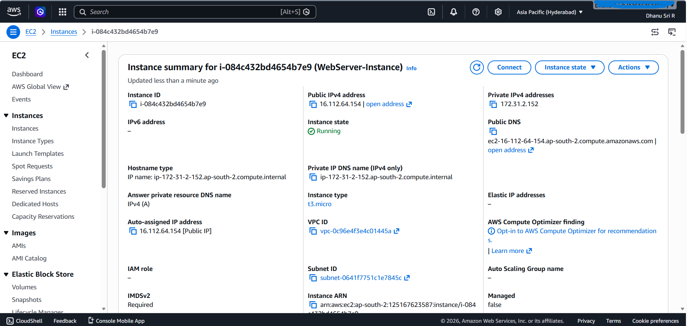

## EBS Volume

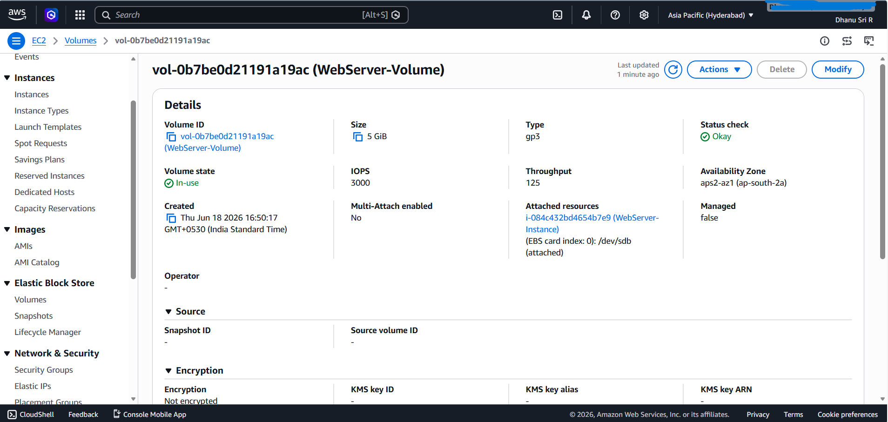

## Apache Web Page

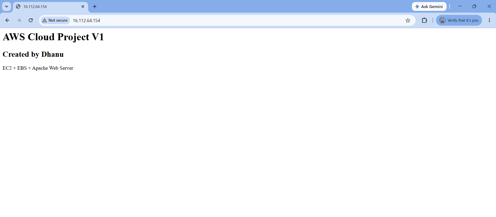

## Snapshot

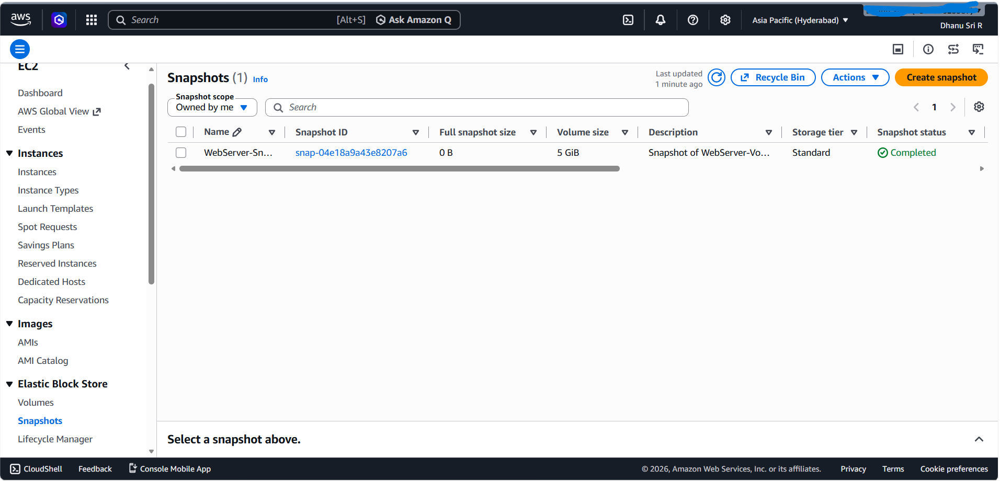

## AMI

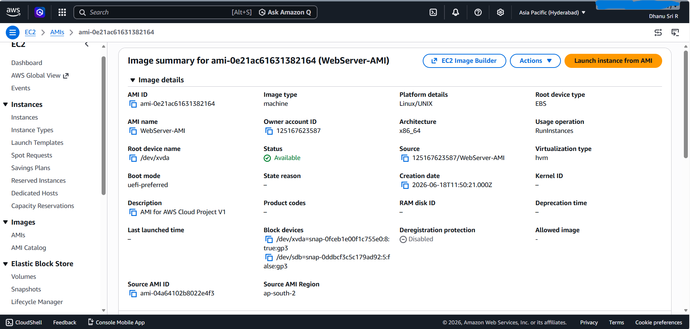

## Launch Template V1

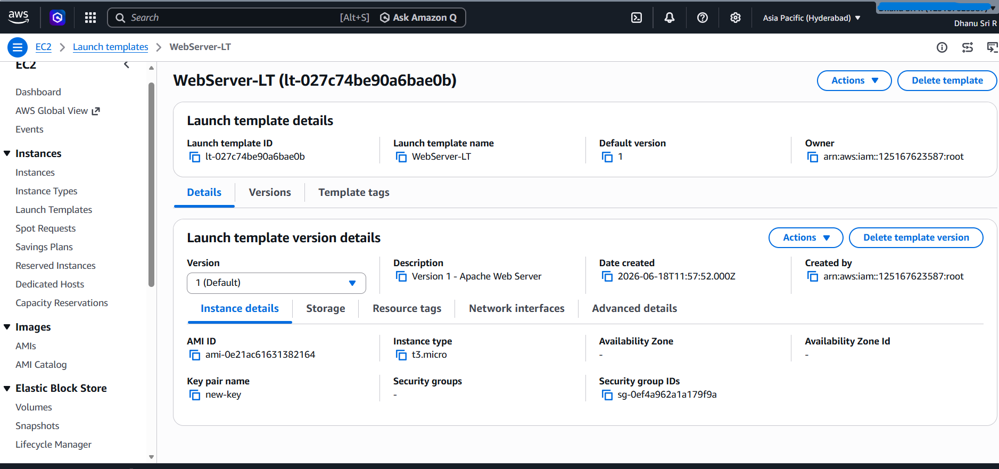

## Target Group


## Load Balancer

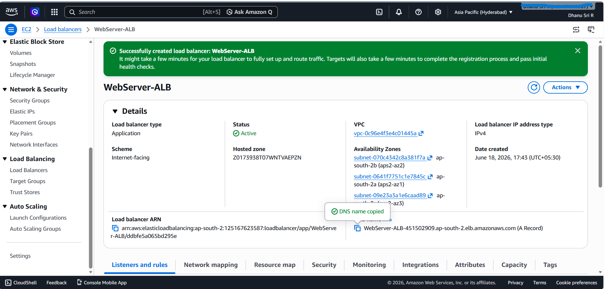

## ALB Testing

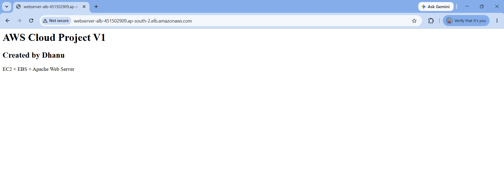

## Auto Scaling Group

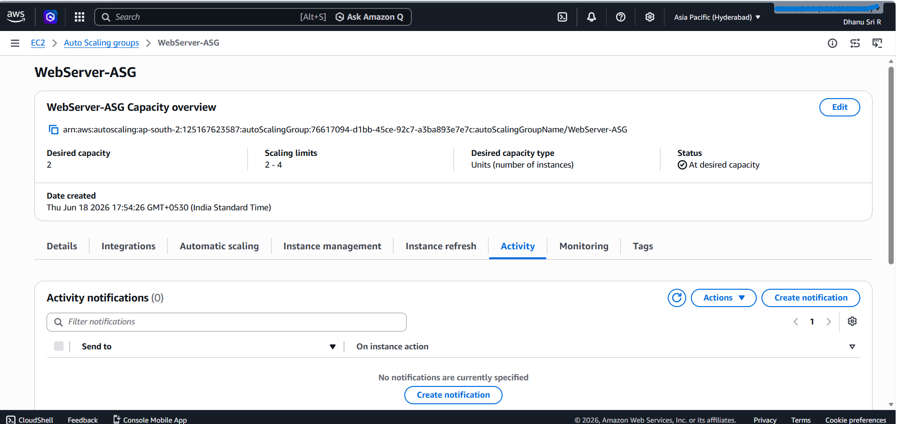

## SNS

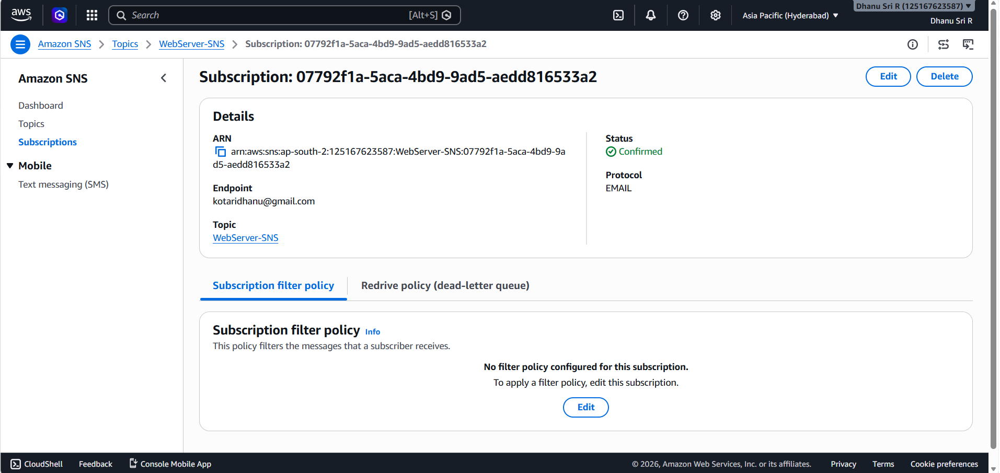

## CloudWatch

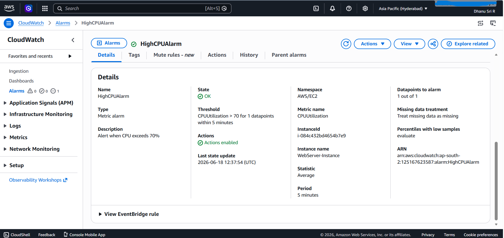

## Lambda

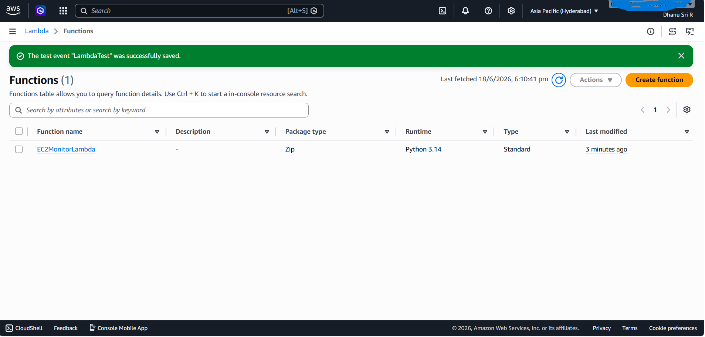

## Launch Template V2

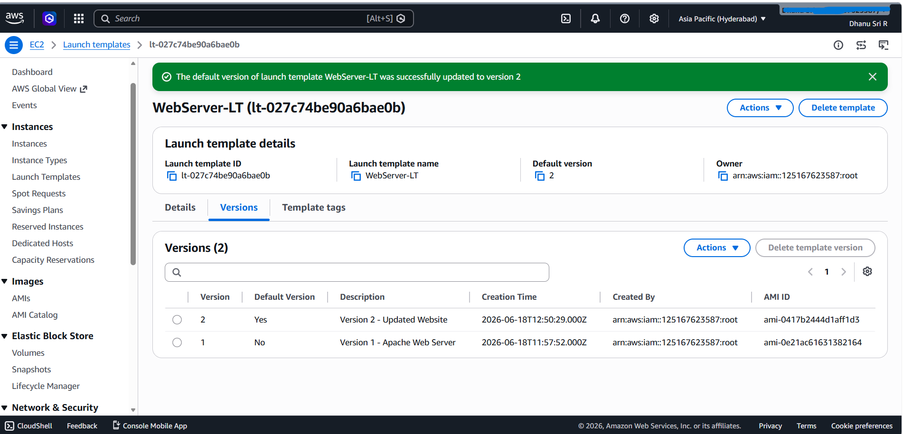

## ASG Updated

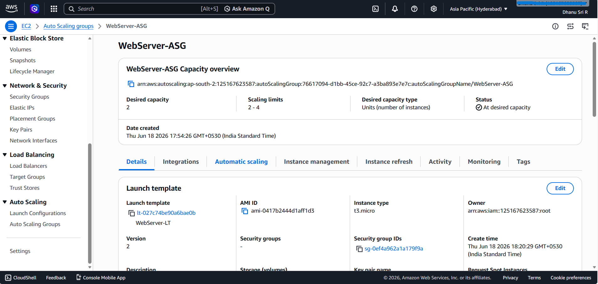

## CloudFormation

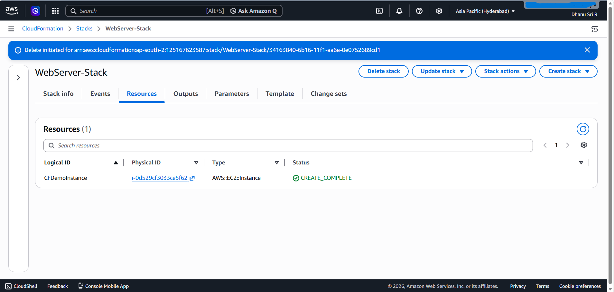

---

# 🔍 Key Learnings

* AWS EC2 Deployment
* EBS Storage Management
* Snapshot and Backup Strategies
* AMI Creation
* Launch Template Versioning
* Application Load Balancer Configuration
* Auto Scaling Implementation
* SNS Notifications
* CloudWatch Monitoring
* AWS Lambda Basics
* CloudFormation Infrastructure Automation
* High Availability Architecture Design

---

# 🚀 Future Enhancements

* HTTPS using ACM Certificates
* Route 53 Domain Integration
* Multi-AZ Architecture
* CI/CD Pipeline using Jenkins
* Docker Containerization
* Kubernetes (EKS) Deployment
* Terraform Infrastructure Provisioning

---

# 👩‍💻 Author

## Dhanu Sri R

LinkedIn:
https://www.linkedin.com/in/dhanu-sri-r-846655398/

GitHub:
https://github.com/Dhanu-Kotari
